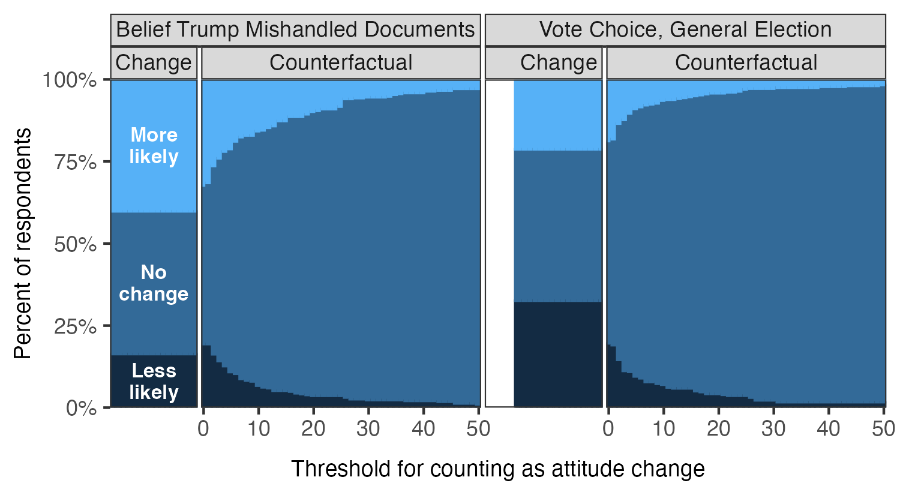
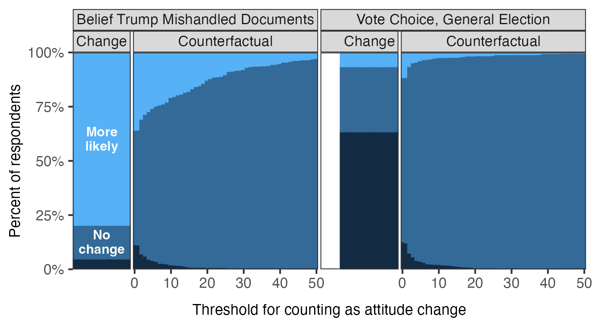
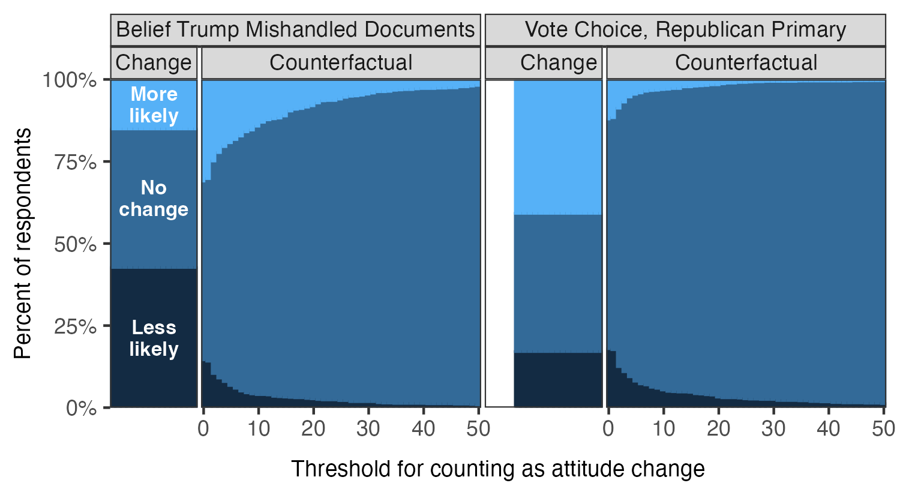

# Reproducibility Report: Barari, Coppock, Graham and Padgett (2024)


- [Paper Overview](#paper-overview)
- [Summary](#summary)
  - [Does the deposited archive run?](#does-the-deposited-archive-run)
  - [Does the maintained rewrite reproduce the
    paper?](#does-the-maintained-rewrite-reproduce-the-paper)
- [Original Archive Reproducibility](#original-archive-reproducibility)
- [Ground Truth Verification](#ground-truth-verification)
  - [In-text claims](#in-text-claims)
  - [Errata](#errata)
- [Maintained Rewrite](#maintained-rewrite)
- [Figure Verification](#figure-verification)
- [R Environment](#r-environment)

*Drafted by Claude Opus 5 under the supervision of Alex Coppock.*

This repository holds the actively maintained replication code for
Barari, Coppock, Graham and Padgett (2024), together with the
reproducibility report that documents what the original archive does and
does not do. It is part of a program applying the maintenance proposal
in Peer, Orr and Coppock (2021, *PS: Political Science & Politics*, doi
[10.1017/S1049096521000366](https://doi.org/10.1017/S1049096521000366))
to a set of published archives.

|  |  |
|----|----|
| Article | [10.1093/poq/nfae061](https://doi.org/10.1093/poq/nfae061) |
| Replication archive | [10.7910/DVN/QDOBJF](https://doi.org/10.7910/DVN/QDOBJF) |
| Pre-analysis plan | None registered |

**The data are not redistributed here.** The deposit lives at Harvard
Dataverse and that is the only copy this repository points at.
`download_original.R` fetches it and verifies every file;
`original_manifest.csv` records the Dataverse file identifiers, the UNF
of the one ingested data file, and two checksums per file: the MD5 of
the bytes Dataverse serves, which is what this code was written against,
and the MD5 Dataverse publishes. Here the two agree for all twelve
files. They do not always, so the script verifies against the served
bytes and reports any disagreement. Either way the exact bytes are
pinned in version control even though the bytes themselves are not.
Re-hosting a copy would create a second archive that can drift from the
first, which is the problem this project exists to document rather than
to add to.

**Repository layout.** `maintained/` is the maintained rewrite: one
script per published table or figure, writing to `output/`, which is
committed so a reader can compare a fresh run against it without
downloading anything. `ground_truth/` ties every published number to the
code that produces it, and also holds `published_claims.csv`, the list
of every numeric token in the article and its appendix, and
`run_deposited_scripts.R`, which runs the archive’s own scripts in a
throwaway copy and records both whether they finish and what they
compute. `maintained/in_text_claims.R` pairs each of those claims with
the sentence that makes it and the number this pipeline produces.
`errata.qmd` at the repository root builds
`barari_etal_2024_errata.pdf`, a short note on the four places where the
article states something its own tables and data do not support.
`original/` is created by the download script and is deliberately absent
from the repository. This README is the reproducibility report, also
available as a PDF in `report/`.

**License.** CC0 1.0 Universal, matching the terms of the deposit this
repository maintains, so nothing in the chain is more restrictive than
the archive itself. See `LICENSE`.

**To reproduce.** Clone or download the repository, open
`barari_etal_2024.Rproj`, and run:

``` r
source("run_all.R")
```

That fetches the deposited archive from Dataverse, verifies its twelve
checksums, reshapes the data, produces every published table and figure
into `maintained/output/`, runs the deposited scripts in a scratch copy,
and rebuilds the ground truth from all of it. A first run takes a few
minutes, most of it downloading the 52 MB deposit. Individual scripts
can be run on their own in any order once `maintained/clean_data.R` has
run once.

Required packages: tidyverse, estimatr, ggh4x, here for the rewrite
itself; xtable and kableExtra in addition, because `run_all.R` also runs
the deposited scripts and those load them; knitr and kableExtra to
render this report. Paths resolve through `here`, so nothing depends on
the working directory and the scripts work equally well under `Rscript`
outside RStudio. A successful run overwrites `maintained/output/`, which
is committed: **`git diff` on that folder is the reproduction check**,
and the CSV and PNG output should come back byte-identical. The six PDF
figures always show as changed, because a PDF records the time it was
written; compare their PNG twins instead.

## Paper Overview

**Citation**: Barari, S., Coppock, A., Graham, M. H., and Padgett, Z.
(2024). Did Trump’s indictments rally his base? Evidence from the
counterfactual format. *Public Opinion Quarterly*, 88(4), 1216-1233.

**Research question**: When a major news event has already reached
almost everyone, how should a pollster measure its effect on opinion?
The article compares two ways of asking respondents to assess that
effect themselves.

**Design**: An opinion poll of 4,838 respondents in the deposited data,
fielded with SurveyMonkey between 22 and 27 June 2023, weighted by
multistage raking to 2019 American Community Survey targets. Half the
respondents were randomly assigned to the *change format*, which asks
directly whether the indictment made them more or less likely to hold a
view. The other half received the *counterfactual format*, which asks
for the current opinion on a 0 to 100 scale and then for the opinion the
respondent would have held had they never heard about the indictment.
The difference between the two answers is that respondent’s own estimate
of the event’s effect. Three topics: belief that Trump mishandled
classified documents, Republican primary vote intention, and general
election vote intention. All estimates are weighted means and weighted
differences in means with robust standard errors.

**Main finding**: The two formats disagree in direction. Under the
change format, 43 percent of Republican primary voters say the
indictment made them more likely to support Trump against 16 percent
saying less likely, implying the indictment helped him. Under the
counterfactual format the same voters put their chance of supporting
Trump at 64.1 percent, against 65.7 percent had the indictment not
happened, an estimated effect of -1.6 percentage points. The authors
read the gap as response substitution: asked how an event changed them,
partisans report the level of their loyalty instead.

------------------------------------------------------------------------

## Summary

Two questions, answered before the detail.

### Does the deposited archive run?

Downloaded whole and run as it stands, four of its six scripts run clean
and two fail, both figure scripts, for the same reason in the same
place. Run instead against a copy holding only the data and the code,
five of the six fail.

| Script | As deposited | Data plus code only | Issue |
|:---|:---|:---|:---|
| prep_data.R | Runs | Runs | Clean |
| figure_1.R | FAILS | FAILS | ggsave() to C:/Users/tuq69844/Dropbox/… , a path on an author’s own machine |
| figure_A1.R | FAILS | FAILS | ggsave() to C:/Users/tuq69844/Dropbox/… , a path on an author’s own machine |
| table_2.R | Runs | FAILS | Reads an .rds the archive ships but no runnable line of it writes |
| table_A2.R | Runs | FAILS | Reads an .rds the archive ships but no runnable line of it writes |
| table_A3.R | Runs | FAILS | Reads an .rds the archive ships but no runnable line of it writes |

The deposited scripts in a current R session

`figure_1.R` and `figure_A1.R` each end with three `ggsave()` calls
writing EPS files to a Windows directory that exists on no other
machine. Every line of computation in both scripts completes before the
first of those calls is reached, so the failure costs nothing but the
figures themselves: running the scripts under `try()` and then writing
out the plotting object recovers every plotted value.

Two further facts about the deposit matter more than the failures.

**Nothing the archive computes is ever written to a file.** Every export
call in all six scripts is commented out: the three `write_rds()` lines
at the end of `prep_data.R`, the `write()` calls in `table_2.R`,
`table_A2.R` and `table_A3.R`, and the local-path `ggsave()` lines in
the figure scripts that survive only in their Windows form. Run the
archive as deposited and it leaves the directory exactly as it found it.
The tables reach the console as LaTeX and nowhere else.

That is also why the four clean scripts are less clean than they look.
`prep_data.R` is the script that builds `dat_clean.rds`,
`dat_long_clean.rds` and `long_topic_clean.rds`, and those are the three
files the other five scripts load; because its `write_rds()` calls are
commented out, it builds them in memory and discards them. The five
downstream scripts run only because the deposit separately ships
finished copies of the same three objects. Take the copies away and
every one of the five stops on the first line that reads one, which is
what the third column of the table above records. The deposit is
internally reproducible only in the sense that its inputs and its
outputs happen to sit in the same folder.

**One published table has no script at all.** Table A.1, the weighted
and unweighted demographic profile of the sample, is not produced by
anything in the deposit. Its inputs are present in `data.csv`, so the
rewrite rebuilds it; see below for what happens when it does.

### Does the maintained rewrite reproduce the paper?

Every published number with a script behind it reproduces exactly. The
table without a script does not, and the reason implicates the deposit
rather than the code.

| Component | Verdict |
|:---|:---|
| Table 2 (main results) | Reproduces, all 54 checkable cells |
| Table A.2 (magnitudes) | Reproduces, all 84 cells |
| Table A.3 (by party identity) | Reproduces, all 84 checkable cells |
| Figure 1 | Reproduces; the article’s own text transposes its panel letters |
| Figure A.1 | Reproduces |
| Table A.1 (sample profile) | Does not reproduce: 35 of 38 cells miss |
| In-text quantities | Reproduce except where the text contradicts Table 2 |

Reproduction verdict by component

Of 283 ground truth claims that can be checked against the rewrite, 236
match the published value and 47 do not. All 222 checkable cells in
Tables 2, A.2 and A.3 agree to the tenth of a percentage point the
article prints, and so do all 204 of those cells that the deposited
scripts also produce. The failures fall into two groups.

**The deposited data are smaller than the survey the article
describes.** The article reports that 5,011 of 6,877 respondents
completed the survey. `data.csv` holds 4,838 rows, with ids running 1 to
4,838 and no gaps, and neither `README.txt` nor `codebook.pdf` mentions
an exclusion. The 173 missing respondents are invisible in Tables 2, A.2
and A.3, every cell of which reproduces from the deposited data, so the
analysis sample is 4,838; the three Ns printed in Figure 1’s caption are
the deposit’s own party identification counts exactly, which is
independent evidence for the same figure. They are not invisible in
Table A.1, which is a profile of the sample rather than an estimate from
it: 35 of its 38 cells are off, by 0.3 of a point at the median and by
no more than 1.4. The article’s weighted Biden approval check, quoted at
40.4 percent against a FiveThirtyEight average of 40.3, comes out at
41.4 percent on the deposited data. Nothing here changes a conclusion;
the point is that a reader who downloads the deposit cannot rebuild the
sample the article describes.

**Three passages in the article contradict the article.** All three are
internal, in the sense that the deposit and the rewrite agree with each
other and with the printed tables, and only the surrounding prose
disagrees.

- Figure 1’s three panels are lettered (a) neither primary, (b)
  Democratic primary, (c) Republican primary in the printed figure,
  which is the order `figure_1.R` writes them in. The caption and the
  body text both assign (b) to Republican primary voters and (c) to
  Democratic. The printed panels settle it: panel (b)’s belief column
  shows 79.5 percent saying “more likely” against 4.9 percent “less
  likely” and its vote column is the general election, which is the
  Democratic profile; panel (c) carries the Republican primary column
  and a belief split of 15.1 against 42.7. Those are the unweighted
  shares Figure 1 plots; Table A.2 gives the weighted versions of the
  same quantities.
- Figure 1’s caption gives the three panel sizes as 754, 2,026 and
  1,953. Those are the counts of Independents, Republican identifiers
  and Democratic identifiers, which are the groups in Figure A.1. Figure
  1 splits by intended primary, and those groups number 889, 2,028 and
  1,921.
- The paragraph describing respondents who intend to vote in neither
  primary reports an effect on beliefs of “+1.8 pp, s.e. = 0.9, p =
  0.05” and an effect on vote choice of “+0.1 pp, s.e. = 0.9, p = 0.89”.
  Table 2 reports 1.5 with p = 0.124 and 0.3 with p = 0.752 for the same
  two cells, and the data give the table’s values. The same paragraph
  gives p = 0.02 for the primary vote effect that Table 2 puts at p =
  0.007. The standard errors quoted in the text are right in every case,
  so the sample is not the difference; the estimates and p-values read
  like a stale draft.

None of the three touches a substantive claim. The neither-primary
effect on beliefs is small and near the conventional threshold either
way, and the sentence’s own characterisation, that the counterfactual
format “suggests indifference” for this group, is if anything better
supported by Table 2’s numbers than by its own.

------------------------------------------------------------------------

## Original Archive Reproducibility

**Archive source**: Harvard Dataverse, DOI 10.7910/DVN/QDOBJF, twelve
files, 52 MB.

The deposit contains six R scripts (`prep_data.R`, `figure_1.R`,
`figure_A1.R`, `table_2.R`, `table_A2.R`, `table_A3.R`), the
respondent-level `data.csv`, three reshaped `.rds` copies of it, a
codebook and a README. Scripts load their data by bare filename and must
be run from the archive directory. They are run here in a throwaway copy
rather than in `original/` itself, because a script that writes into the
directory it reads from can overwrite a deposited file.

**The two failures.** `figure_1.R` and `figure_A1.R` both end with

``` r
ggsave("C:/Users/tuq69844/Dropbox/indictment_counterfactual/submissions/POQ_final/Barari-23-0292.R1 Figure1a.eps", g, "eps", ...)
```

and ggplot2 stops with “Cannot find directory”. The version of each call
that would have worked, `ggsave("figures/thresholds_indep.pdf", ...)`,
sits commented out one line above. The rewrite writes to
`maintained/output/` instead.

**What the archive never writes.** The three `write_rds()` calls at the
end of `prep_data.R` are commented out, as are
`write(out, "figures/tab_overview.txt")` in `table_2.R`, the two
`write()` calls in `table_A2.R` and
`write(out, "figures/tab_overview_party.txt")` in `table_A3.R`. A clean
exit is easy to mistake for success here: four of six scripts finish
without error, and none of them leaves anything behind.
`ground_truth/run_deposited_scripts.R` recovers the numbers by sourcing
each script unmodified and then writing out the objects it built, which
is how `value_script` in the ground truth is filled.

**The three deposited `.rds` files are exactly rebuildable.**
`prep_data.R` derives `dat_clean.rds`, `dat_long_clean.rds` and
`long_topic_clean.rds` from `data.csv`, and the deposit ships both the
inputs and the outputs. The rewrite rebuilds them rather than loading
them, and checks the result with `identical()`, which is what closes the
gap the previous paragraph opens: the shipped copies are what the
deposited code would have written. The serialized bytes differ, since an
`.rds` records the R version that wrote it; the objects do not.

| Object               | Rows rebuilt | Rows deposited | Identical |
|:---------------------|-------------:|---------------:|:----------|
| dat_clean.rds        |        4,838 |          4,838 | TRUE      |
| dat_long_clean.rds   |       72,570 |         72,570 | TRUE      |
| long_topic_clean.rds |       14,514 |         14,514 | TRUE      |

Rebuilt from data.csv against the deposit’s own copies

**Deprecations, none of them fatal.** `rm(list = ls())` opens every
script. `ifelse()` is used throughout where `if_else()` is now
preferred. `table_A2.R` mixes two `%>%` into otherwise native-pipe code,
the only two in the deposit, and uses `summarize_at(vars(...))`,
superseded by `across()`. `table_A3.R` wraps a tidy data frame in
`cbind()` inside `summarize()`, which works but says nothing. `map_df()`
is superseded by `map()` plus `list_rbind()`. `summarize()` emits
grouping messages throughout. None of these changes a number.

------------------------------------------------------------------------

## Ground Truth Verification

Every published float is covered. `value_paper` was typed from the
article, read off rendered pages rather than a text extraction, because
a six-column regression table read from a text dump is one column-shift
away from a phantom erratum. `value_script` is read out of what the
deposited scripts themselves compute, and `value_rewrite` out of
`maintained/output/`, so neither can drift from the code behind it.

| Table or figure  | Rows | Match | Miss | Not verifiable |
|:-----------------|-----:|------:|-----:|---------------:|
| Table 2          |   61 |    54 |    0 |              7 |
| Table A.2        |   84 |    84 |    0 |              0 |
| Table A.3        |   91 |    84 |    0 |              7 |
| Table A.1        |   38 |     3 |   35 |              0 |
| Figure 1         |    3 |     0 |    2 |              1 |
| Figure A.1       |    1 |     0 |    0 |              1 |
| Table 1          |    1 |     0 |    0 |              1 |
| Text, p. 1219    |    5 |     0 |    2 |              3 |
| Figure 1 caption |    3 |     0 |    3 |              0 |
| Text, p. 1217    |    2 |     2 |    0 |              0 |
| Text, p. 1222    |   12 |     7 |    5 |              0 |
| Text, p. 1231    |    2 |     2 |    0 |              0 |

Ground truth coverage by published float

The rows that cannot be verified are of three kinds and each is a
statement about the article rather than a gap in the check. Fourteen
cells across Tables 2 and A.3 carry a p-value the article prints as
`p < 0.001` rather than as a number; a single row per table records that
all seven such cells in each fall below 0.001 in the rewrite, which they
do. Three in-text quantities cannot be rebuilt from a respondent file:
two of them, the 6,877 who began the survey and the 73 percent who
finished it, count respondents who by construction are not in it, and
the third is FiveThirtyEight’s Biden approval average, which is not a
quantity the survey produces at all. Table 1 prints the two question
wordings and no numbers, and the two figures print no numbers either, so
what is checked about them is every proportion they plot. Table A.2,
which the article calls a numerical version of Figure 1, is not one: the
table reports weighted percentages and the figure plots unweighted
shares of respondents, and the two differ by up to 3.6 points.

| Table or figure | Claim | Paper | Rewrite | Locus |
|:---|:---|---:|---:|:---|
| Table A.1 | Gender, Male, unweighted (%) | 48.10 | 48.700 | archive |
| Table A.1 | Gender, Male, weighted (%) | 47.50 | 47.900 | archive |
| Table A.1 | Gender, Female, unweighted (%) | 49.90 | 49.400 | archive |
| Table A.1 | Gender, Female, weighted (%) | 50.20 | 49.900 | archive |
| Table A.1 | Age, 18-24, weighted (%) | 12.10 | 12.300 | archive |
| Table A.1 | Age, 25-34, unweighted (%) | 10.30 | 10.100 | archive |
| Table A.1 | Age, 25-34, weighted (%) | 17.50 | 17.200 | archive |
| Table A.1 | Age, 35-44, unweighted (%) | 13.10 | 12.900 | archive |
| Table A.1 | Age, 35-44, weighted (%) | 16.70 | 16.400 | archive |
| Table A.1 | Age, 45-54, unweighted (%) | 17.00 | 16.800 | archive |
| Table A.1 | Age, 45-54, weighted (%) | 16.00 | 15.800 | archive |
| Table A.1 | Age, 55-64, unweighted (%) | 21.00 | 21.200 | archive |
| Table A.1 | Age, 55-64, weighted (%) | 16.60 | 16.800 | archive |
| Table A.1 | Age, 65+, unweighted (%) | 33.00 | 33.500 | archive |
| Table A.1 | Age, 65+, weighted (%) | 21.00 | 21.500 | archive |
| Table A.1 | Race and ethnicity, White, non-Hispanic, unweighted (%) | 68.20 | 69.000 | archive |
| Table A.1 | Race and ethnicity, White, non-Hispanic, weighted (%) | 63.90 | 64.800 | archive |
| Table A.1 | Race and ethnicity, Black, non-Hispanic, unweighted (%) | 11.50 | 11.600 | archive |
| Table A.1 | Race and ethnicity, Black, non-Hispanic, weighted (%) | 12.70 | 12.900 | archive |
| Table A.1 | Race and ethnicity, Hispanic, unweighted (%) | 12.50 | 12.000 | archive |
| Table A.1 | Race and ethnicity, Hispanic, weighted (%) | 16.40 | 15.800 | archive |
| Table A.1 | Race and ethnicity, Asian, non-Hispanic, unweighted (%) | 2.70 | 2.500 | archive |
| Table A.1 | Race and ethnicity, Asian, non-Hispanic, weighted (%) | 5.40 | 4.900 | archive |
| Table A.1 | Race and ethnicity, Other, non-Hispanic, unweighted (%) | 5.00 | 4.900 | archive |
| Table A.1 | Educational attainment, High school or less, unweighted (%) | 17.90 | 17.800 | archive |
| Table A.1 | Educational attainment, High school or less, weighted (%) | 38.50 | 38.400 | archive |
| Table A.1 | Educational attainment, Some college/associate’s, unweighted (%) | 31.10 | 31.000 | archive |
| Table A.1 | Educational attainment, Bachelor’s, unweighted (%) | 28.50 | 28.400 | archive |
| Table A.1 | Educational attainment, Bachelor’s, weighted (%) | 19.50 | 19.400 | archive |
| Table A.1 | Educational attainment, Graduate degree, unweighted (%) | 22.50 | 22.800 | archive |
| Table A.1 | Educational attainment, Graduate degree, weighted (%) | 11.50 | 11.700 | archive |
| Table A.1 | Biden approval, Approve, unweighted (%) | 43.30 | 44.200 | archive |
| Table A.1 | Biden approval, Approve, weighted (%) | 40.40 | 41.400 | archive |
| Table A.1 | Biden approval, Disapprove, unweighted (%) | 54.00 | 55.100 | archive |
| Table A.1 | Biden approval, Disapprove, weighted (%) | 56.30 | 57.700 | archive |
| Figure 1 | Panel (b) shows Republican primary voters (1 = yes) | 1.00 | 0.000 | paper_internal |
| Figure 1 | Panel (c) shows Democratic primary voters (1 = yes) | 1.00 | 0.000 | paper_internal |
| Text, p. 1219 | Respondents who completed the survey | 5011.00 | 4838.000 | archive |
| Text, p. 1219 | Weighted Biden approval (%) | 40.40 | 41.369 | archive |
| Figure 1 caption | N, respondents intending neither primary | 754.00 | 889.000 | paper_internal |
| Figure 1 caption | N, Republican primary voters | 2026.00 | 2028.000 | paper_internal |
| Figure 1 caption | N, Democratic primary voters | 1953.00 | 1921.000 | paper_internal |
| Text, p. 1222 | Republican primary voters, effect on primary vote, p-value | 0.02 | 0.007 | paper_internal |
| Text, p. 1222 | Neither primary, effect on belief (pp) | 1.80 | 1.454 | paper_internal |
| Text, p. 1222 | Neither primary, effect on belief, p-value | 0.05 | 0.124 | paper_internal |
| Text, p. 1222 | Neither primary, effect on general election vote (pp) | 0.10 | 0.279 | paper_internal |
| Text, p. 1222 | Neither primary, effect on general election vote, p-value | 0.89 | 0.752 | paper_internal |

Every claim that does not reproduce (47 of 283)

`defect_locus` records where each failure lives. `archive` means the
deposit cannot support the claim: here, the 173 respondents it does not
contain. `paper_internal` means the deposit and the rewrite agree with
each other and with the printed tables, and the article’s prose does
not.

### In-text claims

The ground truth is organised by published float, which leaves the
article’s prose thinly covered, and the prose is where three of the four
errors below live. `ground_truth/published_claims.csv` closes that gap.
It lists every numeric token in the article and its appendix, 414 of
them, each with its location and a hand-assigned type: 348 are
quantities this pipeline computes or claims about their shape, 30 are
copied from other people’s polls and from the American Community Survey,
and the rest are question wordings, scale endpoints and dates.

`maintained/in_text_claims.R` carries an entry for each claim the
pipeline can reach, with the article’s sentence quoted verbatim above
the code that computes the number in the article’s own units and
rounding. It reads only `maintained/output/` and
`maintained/clean_data/` and never the ground truth, so the two
instruments arrive at each number by separate paths.
`build_ground_truth.R` runs it, counts the claim lines it prints, and
stops the build unless they account for every claim the extraction says
needs one. Counting rather than matching comment markers is the point:
an entry that errors part way through prints a prefix of its lines and
satisfies a textual check completely.

### Errata

`errata.qmd` builds `barari_etal_2024_errata.pdf`, which records four
places where the article states something its own tables and data do not
support: Figure 1’s panels are printed in an order the caption and the
body text do not describe, page 1222 gives two estimates and two
p-values that its own Table 2 contradicts, page 1222 gives a third
p-value as 0.02 where Table 2 prints 0.007, and Figure 1’s caption
reports the counts of respondents by partisan identity rather than by
intended primary. None of the four changes a conclusion. The corrected
values are computed when the document is rendered, so the note cannot go
stale the way the article did.

The 173 respondents the deposit does not carry are deliberately absent
from that note. A published sentence the archive cannot check is not an
erratum: nothing here establishes that 5,011 is the wrong number, only
that the deposited file holds 4,838.

------------------------------------------------------------------------

## Maintained Rewrite

| Script | Output |
|:---|:---|
| helpers.R | Shared packages and the path anchor |
| clean_data.R | clean_data/\*.rds, output/clean_data_vs_deposit.csv |
| table_a1_demographics.R | output/table_a1_demographics.csv |
| table_2_avg_effect_by_primary.R | output/table_2_avg_effect_by_primary.csv |
| table_a2_magnitude_by_primary.R | output/table_a2_magnitude_by_primary.csv |
| table_a3_avg_effect_by_party.R | output/table_a3_avg_effect_by_party.csv |
| figure_1_thresholds_by_primary.R | output/figure_1{a,b,c}\_\*.{pdf,png} and the plotted values as csv |
| figure_a1_thresholds_by_party.R | output/figure_a1{a,b,c}\_\*.{pdf,png} and the plotted values as csv |
| text_sample_and_weighting.R | output/text_sample_and_weighting.csv |

Maintained rewrite scripts

`table_a1_demographics.R` has no counterpart in the deposit. It
collapses the deposited response options into the categories Table A.1
prints (five race categories, four education bands, approve against
disapprove) and computes weighted and unweighted shares on the
full-sample denominator. That denominator is why the published Gender
and Biden approval columns fall short of 100: a third gender option and
a “no answer” on approval sit in it without appearing on the page.

Both figure scripts write a CSV of every proportion they plot. A PDF
differs from its predecessor on the timestamp alone, so without that CSV
the reproduction check on a figure-only output is vacuous. Those CSVs
are also what make the comparison against the deposited scripts
possible: all 1,206 plotted proportions in Figure 1 and 1,717 in Figure
A.1 agree with the values `figure_1.R` and `figure_A1.R` compute before
they fail, to within 5.6e-16, which is floating-point noise rather than
a difference in the numbers.

| Original | Rewrite |
|:---|:---|
| rm(list = ls()) | removed |
| library() in each script | source(helpers.R); all packages in helpers.R |
| setwd() and bare filenames | here::here() |
| ggsave() to a hardcoded Windows path | ggsave() to maintained/output/ |
| write() and print.xtable to the console | write_csv() to maintained/output/ |
| commented-out write_rds() calls | write_rds() to maintained/clean_data/ |
| %\>% | \|\> |
| ifelse() | if_else() |
| map_df() | map() + list_rbind() |
| summarize_at(vars(N, Pct), sum) | summarize(across(…)) written out explicitly |
| cbind(tidy(lm_robust(…))) | reframe(tidy(lm_robust(…))) |
| theme_minimal() | theme_bw() |

Deprecated patterns and replacements

**What was left alone.** Two decisions in the deposit look odd and are
not the rewrite’s to change. The counterfactual difference is estimated
by `lm_robust(value ~ 1, weights = weight)`, an intercept-only weighted
regression, which is a weighted mean with an HC2 standard error; it is
unusual notation for a familiar quantity but it is the right quantity,
and it is what the article reports. And Table A.2’s magnitude bands are
cut on the absolute difference with `abs_value <= 0.05` counted as “1-5
percent”, so a respondent who moved by exactly zero is separated out
first and the bands are closed on the right. Both are analytical
choices, so both stand.

The archive’s `xtable` calls do not survive, but not because `xtable` is
unwelcome: the deposit uses it to build a body of LaTeX rows that it
never writes to a file, and the rewrite writes tidy CSVs that the ground
truth can read cell by cell. The deposited LaTeX is still produced, in
the scratch copy, by `ground_truth/run_deposited_scripts.R`, which is
what fills `value_script`.

------------------------------------------------------------------------

## Figure Verification

Figure 1’s three panels, in the order the article prints them.







Each panel puts the change format on the left of its own vertical rule
and the counterfactual format to the right, swept across thresholds from
0 to 50 points. The comparison the article draws is between the
change-format bar and the counterfactual stack at threshold 0, where any
difference at all counts as change. In panel (a) the largest gap between
the two formats is 16 points. In panels (b) and (c) it reaches 51 and
29, and the divergence runs in the direction each group’s partisanship
would predict, which is the evidence for response substitution.

The panel lettering in the article is transposed, as described in the
Summary. The maintained files are named for the group each panel
actually shows, so `figure_1b_thresholds_democratic` is the file
corresponding to the article’s printed panel (b).

------------------------------------------------------------------------

## R Environment

| Package    | Version |
|:-----------|:--------|
| tidyverse  | 2.0.0   |
| estimatr   | 1.0.6   |
| ggh4x      | 0.3.1   |
| xtable     | 1.8.8   |
| knitr      | 1.51    |
| kableExtra | 1.4.0   |
| here       | 1.0.2   |

Key package versions

R version: R version 4.6.0 (2026-04-24)

The deposit’s README records the environment it was built in: R 4.3.1 on
Windows, tidyverse 2.0.0, estimatr 1.0.0, ggh4x 0.2.6, xtable 1.8-4,
kableExtra 1.3.4, on 7 January 2024.
